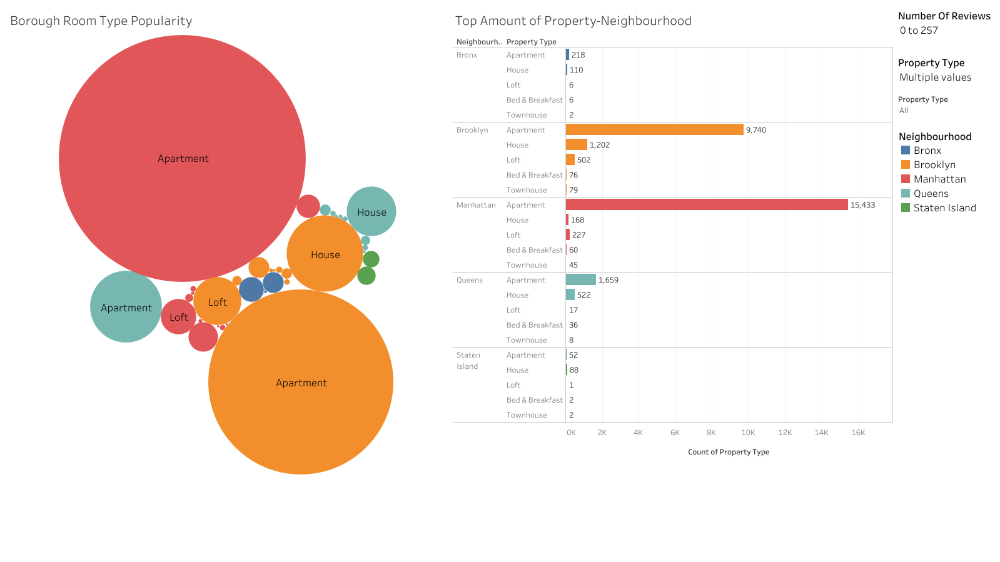
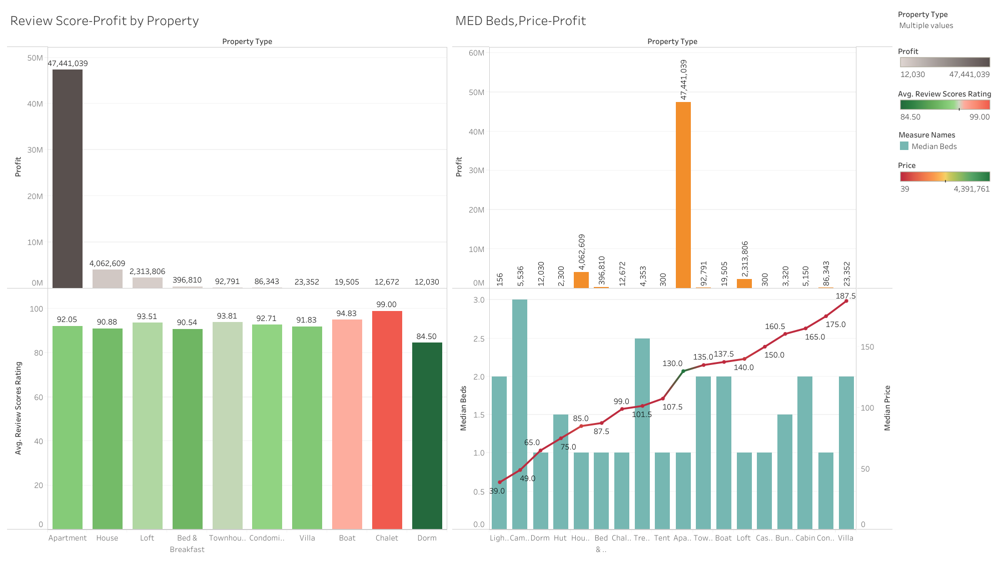
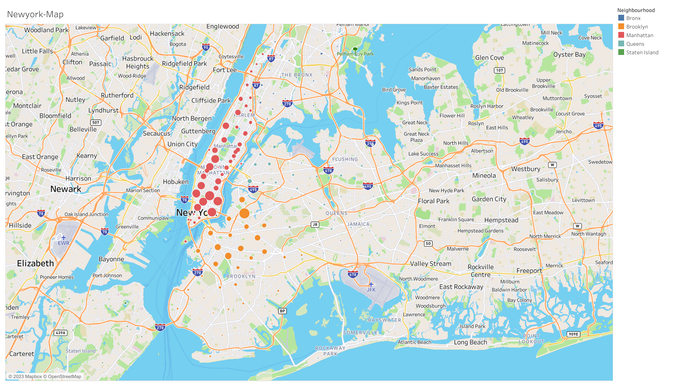
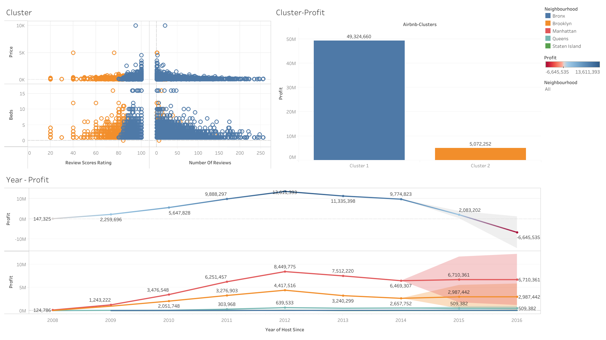

# Final-Project-Tableau

## Project/Goals
In this project, the dataset consisted of a table of Airbnb listings in New York from 2008 to 2014. In order to gain a comprehensive understanding of the data, I created 8 visualizations to identify patterns, trends, and predict future profit. During the process of building the dashboard, I revised my questions as needed.

## Process
1. Classify and quantify the information
2. Generate questions
3. Evaluate crucial factors affecting Airbnb profits
4. Represent data graphically
5. Discover significant patterns and tendencies
6. Develop a visual representation for presentation purposes.

## Results

### Question 1: What is the most popular Airbnb property type in New York City?

The most sought-after property type for Airbnb in New York City is apartments. There are a significant number of apartments in Manhattan (15,433) and Brooklyn (9,740) that are being used for Airbnb, with Manhattan having the largest concentration of these properties.

### Question 2: What factors influence Airbnb's profitability?

There are four critical elements that impact profitability are the review rating, cost, number of beds in the rental property, and location.

As demonstrated by the bar graph, the overall review score of the properties is quite comparable. Nonetheless, apartments have the most significant profits among the various property types because of their popularity. Additionally, Airbnb customers are more inclined towards one-bedroom apartments that cost around $130

Manhattan and Brooklyn have the largest concentration of Airbnb properties and generate the highest revenue for Airbnb among the five boroughs of New York City.

### Question 3: Profit over the year and forecasting

The cluster was determined based on four factors: the number of reviews, the review score, the property price, and the number of beds. All of these factors have statistically significant p-values less than 0.05. Tableau generated two clusters as a result:

    .Cluster 1 has a higher number of reviews, a higher review score, a higher property price, but a lower number of beds.

    .Cluster 2 has a lower number of reviews, a lower review score, a lower property price, but slightly more beds.
    
The chart shows that Cluster 1 has a higher profit compared to Cluster 2 with a 162.7% increase approximately.

Between 2008 and 2012, the total profit in Airbnb New York City saw a dramatic increase, rising from $147,325 to $13,611,393. However, starting in 2013, profit started to decline dramatically and is expected to decrease further due to regulatory issues and hosts listing illegally

## Challenges 
Need more time to explore and analyze the data

## Future Goals
Conduct further research on the New York Airbnb market for a more in-depth analysis.
